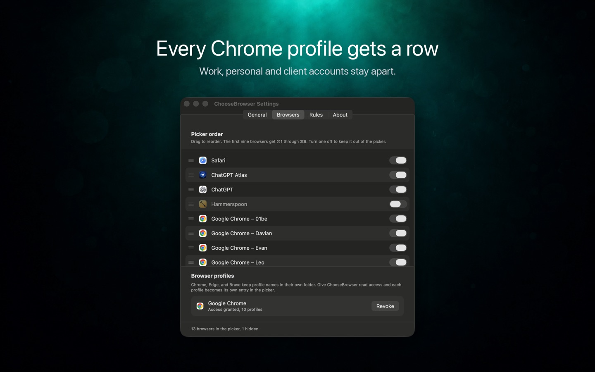

# chrome-use

**English** · [简体中文](README.zh.md)

<p align="center">
  <a href="https://github.com/leeguooooo/chrome-use/releases"></a>
  <a href="https://github.com/leeguooooo/chrome-use/stargazers"></a>
  <a href="https://bot-detector.rebrowser.net/"></a>
  
  <a href="LICENSE"></a>
</p>

<p align="center"><i>⭐ If it saves you a re-login, a star helps other devs find it.</i></p>


<p align="center">
  
  <br>
  <sub>Point it at a page in your <b>real</b> Chrome → get structured data in one command. <a href="assets/demo.tape">(regenerate: <code>vhs assets/demo.tape</code>)</a></sub>
</p>

**chrome-use** drives your real, logged-in Chrome from any AI agent. It shares your existing login sessions and uses your existing browser profile; public detector results are documented, not a guarantee for every website. Part of the `*-use` family ([iphone-use](https://github.com/leeguooooo/iphone-use) drives your real iPhone; [bitwarden-use](https://github.com/leeguooooo/bitwarden-use) pulls passwords/2FA/passkeys from your Bitwarden vault so an agent can log in with credentials; chrome-use drives your real Chrome).

<sub>Originally based on [vercel-labs/agent-browser](https://github.com/vercel-labs/agent-browser) (Apache-2.0); now a standalone project. The stealth/extension-relay architecture, anti-detection, humanize, multi-agent isolation, and CLI have diverged substantially.</sub>

> 📚 **Documentation:** **[chrome-use.leeguoo.com](https://chrome-use.leeguoo.com)**: full guides, workflows & command reference (中文 · English).
>
> 📖 **Deep dive:** [Letting an agent click into cross-origin iframes: how chrome-use solves the hardest part of browser control](https://blog.leeguoo.com/en/posts/chrome-use-cross-origin-iframe/)
> · [Driving your already-logged-in real Chrome (CreepJS scores it 0% bot), 中文](https://blog.leeguoo.com/zh/posts/chrome-use-drive-your-real-chrome/)

## Give your AI agent the browser you already live in

**No fresh Chrome. No re-login. No "are you a robot?" walls.**

chrome-use points **any** agent (Claude Code, Cursor, Codex, your own scripts) at the **Chrome you're already signed into everything on**. It clicks in *your* window, so you watch it work and grab the wheel the moment it hits a 2FA prompt or captcha. And because it's literally your real browser (over a one-click extension, native messaging, no debug port), the documented CreepJS test reported: **[CreepJS scores it 0% bot](#anti-detection).**

A **new browser context** starts without your existing login sessions. Playwright and Puppeteer also support persistent profiles and existing-browser connections; compare the actual configuration. **chrome-use** connects to your existing Chrome. Your cookies, sessions, and browser fingerprint are all real, because it IS your real browser. Chrome 136 restricts remote debugging of the default profile; prompts and requirements depend on Chrome version and connection mode. Our extension uses native messaging instead: **install once, then zero per-use confirmation.**

| | Typical automation (Playwright · Puppeteer · browser-use) | web-access / raw CDP port | [Claude in Chrome](https://www.anthropic.com/claude/chrome) | **chrome-use** |
|---|:---:|:---:|:---:|:---:|
| Works with **any** agent / CLI (not one app) | ✅ | ✅ | ❌ Claude only | ✅ |
| Drives your **real, logged-in** Chrome | Configurable; fresh contexts start empty | ✅ | ✅ | ✅ |
| Connect method / **"Allow remote debugging?" popup** | — (own browser) | `--remote-debugging-port` · version/mode dependent | `chrome.debugger` · no | native messaging · **never** ✅ |
| Real-browser fingerprint (CreepJS ~0%)¹ | ❌ automation markers / headless | ✅ | ✅ | ✅ **verified 0%** |
| **No `Runtime.enable` CDP leak** (rebrowser)² | ❌ leaks | ❌ leaks | — | ✅ **off by default** |
| Many agents on **one** real Chrome, isolated tab groups³ | ❌ separate browsers | ⚠️ shared tabs, no isolation | ❌ single app | ✅ |
| Permissions footprint | full control | full CDP | 16 incl. `<all_urls>` | **12, no `<all_urls>`** |

<sub>¹ All three real-Chrome tools score ~0% on CreepJS (it's a real browser); we've measured ours. ² rebrowser's `runtimeEnableLeak`: verified clean on our relay path; Claude in Chrome not independently tested (—). ³ web-access can run parallel sub-agents on one browser, but without per-session isolation; each `--session` here gets its own colored, command-isolated tab group. See [Anti-detection](#anti-detection) for the measured numbers.</sub>

## How it works


Your **chrome-use CLI** talks to a tiny **browser extension** over Chrome
**native messaging**: a local inter-process channel, *no network socket, no
token, no remote server*. The extension uses `chrome.debugger` to drive the tabs
you target in **your own, already-logged-in Chrome**, then hands results back to
the CLI. Everything stays on your machine.


Each `--session` gets its **own colored Chrome tab group**, so multiple agents
can share one real browser concurrently without stepping on each other, or your
own tabs. When `--session` is omitted, chrome-use derives a stable per-agent
session from supported runner IDs, including Codex's `CODEX_THREAD_ID`.
Explicit `--session` / `AGENT_BROWSER_SESSION` always win. Session naming,
`session list` / `stop` / `prune`, ownership handoff, and daemon recovery are
covered in the [sessions guide](https://chrome-use.leeguoo.com/en/sessions.html).

## Install

**macOS / Linux**

```bash
curl -fsSL https://raw.githubusercontent.com/leeguooooo/chrome-use/main/install.sh | sh
```

**Windows** (PowerShell)

```powershell
irm https://raw.githubusercontent.com/leeguooooo/chrome-use/main/install.ps1 | iex
```

Downloads the prebuilt binary for your platform from the latest [GitHub Release](https://github.com/leeguooooo/chrome-use/releases) and installs `chrome-use` (+ the `abs` alias). No npm, no tokens.

<details>
<summary>Other ways to install</summary>

- **Pin a version:** `AGENT_BROWSER_VERSION=v0.27.0-fork.12 curl -fsSL https://raw.githubusercontent.com/leeguooooo/chrome-use/main/install.sh | sh`
- **Custom location:** `AGENT_BROWSER_BIN_DIR=$HOME/bin curl -fsSL … | sh`
- **Windows, pin a version or location:** `$env:AGENT_BROWSER_VERSION = 'v1.5.139'` or `$env:AGENT_BROWSER_BIN_DIR = 'D:\tools'` before the `irm … | iex` line. It installs to `%LOCALAPPDATA%\Programs\chrome-use` by default and adds that to your user PATH, keeping the existing entries exactly as they were (opt out with `$env:AGENT_BROWSER_NO_PATH = 1`). No admin rights needed.
- **Windows, by hand:** download `chrome-use-win32-x64.tar.gz` and its `.sha256` from the [Releases page](https://github.com/leeguooooo/chrome-use/releases), check that `(Get-FileHash chrome-use-win32-x64.tar.gz -Algorithm SHA256).Hash` matches the `.sha256` file, extract with `tar -xzf chrome-use-win32-x64.tar.gz`, and put `chrome-use.exe` on your PATH. Check the hash before running it: an interrupted download still extracts into an `.exe`, which then fails at launch with an access violation (exit code `-1073741819`, `0xC0000005`) rather than anything that says the download was incomplete.
- **npm (legacy):** `npm install -g chrome-use`. Still published, but GitHub Releases is the primary channel now.
</details>

### Install with Nix

Run it once, no install: `nix run github:leeguooooo/chrome-use -- --help`.
The flake also ships a home-manager module and a NixOS module (`programs.chrome-use.enable = true`); on NixOS the native-messaging host is registered per-user, so run `chrome-use extension connect` once after switching.
Dev shell: `nix develop` (rust toolchain + node 24 + pnpm + chromium + vhs).
Full snippets: [install guide](https://chrome-use.leeguoo.com/en/install.html).

### Install the AI agent skill

With a current CLI, the installers install and verify its bundled discovery skill without Node, npx, Git or another download. To install or refresh it manually:

```bash
chrome-use skill install
chrome-use skill install --project
```

Global installation covers `~/.agents/skills`, Claude Code, Codex and Cursor, plus existing Pi, OpenCode, Windsurf, CodeBuddy and Trae configurations. It respects `CLAUDE_CONFIG_DIR` and `XDG_CONFIG_HOME`. Project installation uses `.agents/skills` and `.claude/skills`, plus existing `.pi`, `.windsurf`, `.codebuddy` and `.trae` configurations. Restart your agent or reload its skills afterward. A failed write is an error, even if other destinations succeeded. See [installation details](https://chrome-use.leeguoo.com/en/install.html).

**Claude Code, plugin marketplace (recommended):** installs the skill globally (all projects), auto-updates, and lists the rest of the [`*-use` family](https://github.com/leeguooooo/plugins):

```
/plugin marketplace add leeguooooo/plugins
/plugin install chrome-use@leeguooooo-plugins
```

**Additional runners:** [skills.sh](https://skills.sh) remains available for runners outside the built-in mappings. This alternative requires Node and its own dependencies:

```bash
npx skills add leeguooooo/chrome-use -g
```

> The install one-liners already install the bundled skill (opt out with `AGENT_BROWSER_NO_SKILL=1`). PowerShell also extracts it from older pinned CLI releases, bypassing their npx installer. Installation errors stop completion; the final message does not claim that the Chrome extension is connected.

> **Codex users:** Codex ships its own browser plugin and picks it for browser tasks. Measured on a machine with many skills installed, Codex also trims every skill description to a few characters (or none), so the skill's description cannot win the routing, and naming `chrome-use` in the prompt was not enough either. What worked was one line in the project's `AGENTS.md`:
>
> ```text
> Use the `chrome-use` CLI from the shell for every browser task; start with `chrome-use skills get core`. Do not use the built-in Chrome plugin for browser work here.
> ```

Either way the agent gets the right usage patterns and pre-approved bash permissions for `chrome-use` and `abs`; the skill self-heals a missing binary by re-running the install one-liner above for its platform. Specialized guides (`electron`, `slack`, `agentcore`, …) are served by the binary itself via `chrome-use skills get <name>`, so instructions always match the installed version.

The installed discovery skill should direct the agent to `chrome-use skills get core`; it should not carry a second command manual. If an older installed copy contains its own workflow without that handoff, refresh it before comparing core-guide changes.

Upgrading the binary does **not** move a SKILL.md already copied into a runner; that copy lives outside the binary. `chrome-use upgrade` handles both: it installs the latest GitHub Release, then refreshes each installed copy of the skill it finds (Claude Code plugin, a git checkout, or the folders its installer writes; for an `npx skills add` copy it prints `npx skills update chrome-use`). `chrome-use upgrade --check` (or `--json`) changes nothing and reports current vs latest plus where the skill is installed; exit code 2 means the check failed. Other commands check for a newer release at most once a day, in the background, and while one exists print one line to stderr on each run; `CHROME_USE_NO_UPDATE_CHECK=1` or the family-wide `USE_NO_UPDATE_CHECK=1` turns that off. To refresh only the skill, run `chrome-use skills update` (`refresh` and `install` are the same command; add `--project` to install into `./` instead of globally).

### Use from an MCP client (Claude Desktop, etc.)

For hosts that speak **MCP but can't run arbitrary shell commands** (Claude Desktop, ChatGPT connectors, n8n/Dify), run chrome-use as an MCP stdio server by wiring it into Claude Desktop's `claude_desktop_config.json`:

```json
{
  "mcpServers": {
    "chrome-use": { "command": "chrome-use", "args": ["mcp"] }
  }
}
```

## Setup: connect to your Chrome

Install the [**chrome-use** extension from the Chrome Web Store](https://chromewebstore.google.com/detail/chrome-use/knfcmbamhjmaonkfnjhldjedeobeafmk), then register the local bridge once:

```bash
chrome-use extension install      # register the native-messaging host (one-time)
chrome-use open https://x.com/home
chrome-use status                 # relay, profile, extension, and session health
```

`chrome-use open` then drives your real, logged-in Chrome over **native messaging**: no debug port, no token, and **no "Allow remote debugging?" dialog, ever**. The raw remote-debugging-port alternative (which pops a consent dialog) is described in the [real Chrome guide](https://chrome-use.leeguoo.com/en/real-chrome.html).

### Multi-profile Chrome: ChooseBrowser rules

If you keep several Chrome profiles (work, personal, a client's), you already know which account each site belongs to, and you tell us with `--browser` every time. [ChooseBrowser](https://choosebrowser.leeguoo.com) is a macOS link router that stores that mapping. When it is installed, `chrome-use open <url>` without an explicit `--browser` follows the rule you already wrote for that site, and says so:

```
$ chrome-use open https://github.com/my-org/repo
· using Chrome profile Profile 14 — a ChooseBrowser rule routes this site there
  (github.com|/my-org*). Override with --browser <id|email>, or skip with
  --no-choosebrowser.
```

Read-only, and invisible if you do not use it: no rules file means no behaviour change and no message. A rule is binding: chrome-use never opens the site in a different profile. If the rule's profile is not connected, the command fails and names `chrome-use connect --browser <profile>`. If the session is already bound to another profile, it fails and suggests a new `--session` or `--no-choosebrowser`. `--browser` and config routes still win. The check covers `batch` steps, MCP tool calls and script steps as well as direct commands. A rule whose profile no longer exists only warns. `chrome-use doctor` lists each rule and whether its profile is connected. Add `--remember` to an explicit `--browser` and chrome-use asks ChooseBrowser to write the rule back, behind its own confirmation dialog.

<a href="https://choosebrowser.leeguoo.com"></a>

**ChooseBrowser** is a macOS link router by the chrome-use author. Set it as your default browser once, and every link you click asks which browser, or which Chrome profile, it should open in.

- A row for every profile in Chrome, Edge, Brave, Vivaldi or Chromium; work, personal and client accounts stay apart.
- Rules that match a path, not just a domain, so one site can route to two browsers.
- `⌘1`–`⌘9` opens instantly, `⌥↵` teaches it once, and it learns which browser you prefer per site.
- No accounts, no tracking, no analytics. Optional sync through your own iCloud.

Free for 7 days, then **US$4.99 one-time for up to 3 Macs**. Notarized `.dmg`; macOS 26 or later. [Download](https://choosebrowser.leeguoo.com) · [Full guide](https://chrome-use.leeguoo.com/en/choosebrowser.html). chrome-use does not depend on it.

<br clear="all">

## Usage

A wait-condition timeout alone does not diagnose a browser connection failure. `wait --text` matches a case-sensitive substring: use the actual page wording, and do not wait again after the requested receipt is already visible.

`chrome-use skills get core` includes the everyday action loop and ordinary form commands. Load `core/reading`, `core/connection`, or `core/site-adapters` only when that task needs the detail; an ordinary click does not require another reference. Use the cheapest state check that answers the next question, and stop once an authoritative page signal confirms the goal.

The core loop: open, read, act, re-read only what changed.

```bash
chrome-use open https://example.com    # connect to your Chrome and navigate
chrome-use snapshot -i                 # the start of every interaction: interactive elements with @refs
chrome-use click @e3 --observe         # act, and watch for the page's reaction
chrome-use snapshot -i --diff          # only what changed since the last snapshot
```

Prefer `snapshot -i -c` for compact controls, scoped reads for a known region, and `--diff` only when the last observation leaves a question. Use `batch` for known action sequences (a step takes its own `--observe`: `batch "fill @e1 Ada" "click @e2 --observe"`; `pick` observes like `click`), `script` for bounded observe/decide/act/verify flows, and `form fill --map` for several fields. Verify the requested result at the end: `observed.status: complete` means the capture is complete, not the task, so wait for the page's own final signal (`wait --text`). An element screenshot is `screenshot <selector> <path>` or `screenshot <path> --selector <selector>`. Add `--with-screenshot <path>` only when pixels answer a question the tree cannot.

Semantic `find role/text/label/placeholder/alt/title/testid` requires exactly one visible match, including locate-only queries. Ambiguity returns up to eight candidates with visible state and selector/context hints; no action is dispatched and input values are omitted. Narrow `--name`/`--exact`, or use `--within <CSS|@ref>` to restrict the query to exactly one container. A scope must belong to the active tab's main document; cross-frame refs and an explicitly selected iframe are refused; use direct frame refs or `frame main`. `find first/last/nth` explicitly selects an order and keeps its existing behavior. Plain CSS actions are unchanged. Roles and label names use Chrome accessibility data, including `aria-labelledby`; a semantic query re-resolves on each call. A detached target before dispatch fails safely; uncertain actions are never replayed.

The existing `chrome_use_find` tool in `mcp --tools all` accepts `within` with the same unique-scope rules; tool count is unchanged. `text` for fill/type is passed literally, including `--name --observe`, rather than parsed as CLI options.

Semantic find retains the existing `--observe` unsupported warning; use one `batch` containing the scoped find action and a task-specific `get text` receipt when both are known. The MCP find tool does not advertise an observe field.

Discover a scope from the page first: `find query "Beta account"` returns candidate selector anchors; choose the article/container corresponding to that heading, then use `find role button click --name Save --exact --within "<returned-selector>"`. Inspect an ambiguous scope with `snapshot -s "<selector>"` and narrow it rather than accepting the first container. Unknown semantic-find options and duplicate `--within` are refused; use `find label Email fill -- --name` to enter literal flag-looking text. `--exact false` requests substring matching.


After three identical observed `click`, `dblclick`, or `press` attempts on the same target and screen, with no gap over 60 seconds, `observed.noProgress` advises checking state or waiting for a task-specific condition. It requires complete, settled evidence with no detected tree, request, resource, or frame activity. The hint does not change action success, prove a write failed, or retry it.

Ordinary CLI/MCP connection preparation preserves this streak only on successful reuse of the same browser connection, target and session, without loading storage state. A new browser, rebind, failed preparation or storage-state load still clears the count.

Scripts retain these hints in `advisories` (top-level in CLI `script --json`; `data.advisories` in the daemon envelope) (at most 20), including nested scripts and runs that later fail. JSON op-list scripts also keep `noProgress` on the relevant `steps` entry; text output prints the aggregate advisories once. A failed JS script retains `ok:false`, `return:null`, `error`, `logs`, and `advisories`. Nested script daemon-envelope `data.ok:false` fails the parent script even when transport `success` is true; dispatch success does not establish program success.

Ordinary CLI `--json` replies use a `success`/`data`/`timing` envelope. `batch --json` prints an array of `{command,success,result,error}` entries; `script --json` prints the bare program result (`ok`, `return`, `logs`, `error`, `advisories`, and other program fields). Batch and script CLI output have no top-level `timing`.

JSON command timing includes `cdpMs` (sum of completed foreground CDP request durations), `cdpBusyMs` (their interval union within command wall time), and `nonCdpMs` (wall time minus that union). Concurrent requests can make `cdpMs` exceed wall time; these are elapsed durations, not CPU measurements. Background tasks do not inherit the recorder; `nonCdpMs` is not pure daemon processing time. Tool/HTTP calls are not model round trips; only caller traces establish those. See [task measurement](https://chrome-use.leeguoo.com/en/core-loop.html#task-efficiency) for task measurement.

The agent operates in your Chrome: you'll see tabs opening, pages loading, clicks happening in real time. You can take over at any point (e.g. solve a CAPTCHA), then let the agent continue.

For an authorized task, the bundled skill tells the agent to inspect and attempt ordinary CAPTCHAs before handing off: `solve-slider` for ordinary and rotating Yidun puzzles, screenshot-guided ordered clicks for readable icon challenges, then verify the site's result and continue. Load `chrome-use skills get core/captcha`. Attempts are bounded; unavailable or ambiguous challenges still need a handoff. This workflow does not guarantee every provider or challenge can be solved. Activate the target before capturing coordinates; a provider success or frozen resend countdown does not establish site acceptance.

| Command | Purpose |
|---|---|
| `chrome-use open <url>` | Connect to your Chrome and navigate |
| `chrome-use snapshot -i` | Read the page; the start of every interaction |
| `chrome-use click "Post"` · `click @e3` · `click 449 320` | Click by text, by snapshot ref, or on a raw viewport coordinate |
| `chrome-use fill "Title" "Hello World"` · `type @e3 "text"` | `fill` replaces a whole value and `type` appends, both with trusted input events; a ⚠ warning says when the page did not react (e.g. its Save stayed disabled) |
| `chrome-use network request <id>` | Read the recorded response body from its originating renderer, including cross-origin frames; unavailable bodies carry `responseBodyError` |
| `chrome-use screenshot ./page.png` | Save visual evidence; use it for image challenges and canvas targets, and refs for ordinary controls |
| `chrome-use solve-slider 1` · `skills get core/captcha` | Attempt a Yidun puzzle (nonzero exit if unsolved); load ordered clicks and verification |
| `chrome-use find "edit web service settings button"` | Ranked, non-acting candidates from a natural-language description |
| `chrome-use actions @e15` · `do @e15 expand` | What this element supports right now, and perform one of exactly those |
| `chrome-use click @e2 --follow` | A tab the click opened (`target=_blank`, `window.open`) is reported as `openedTab` and joins the session; `--follow` moves to it. In your own Chrome only tabs opened by the session's tabs are taken, attached by tab id (ab-connect 0.5.30+); otherwise `openedTabWarning` / `openedTabStatus` (`unadopted`, `unknown`) say why |
| `chrome-use tab list` · `tab select t2` · `tab adopt <url-substring\|targetId>` | List tabs; select a created or adopted tab; attach an already-open tab through the extension or direct CDP without navigating it |
| `chrome-use tab new [url] --activate` · `tab select t2 --activate` · `tab adopt <targetId> --activate` | Raise the target before initialization or the liveness probe; `--front` is an alias |
| `chrome-use dialog status` · `dialog accept\|dismiss` | Handle a native `confirm()` / `prompt()` opened by a click |
| `chrome-use download @e2 ./video.mp4` | Download with the same cookies as the logged-in browser, without navigating the current tab |
| `chrome-use network route "*/api/me" --body '{"vip":true}'` | Mock a response, rewrite an outgoing request, or block one |
| `chrome-use site github/issues epiral/bb-browser --json` | Run a site adapter and get clean JSON from the site's own API |
| `chrome-use session list` · `session stop [name]` | Manage session workers |
| `chrome-use auth login --bwu [--item <id\|name>]` | Fill the current login page from Bitwarden; handles TOTP and supported passkey second factors |
| `chrome-use auth login --bwu --passkey` | Sign in with a vault passkey in `--launch` mode (bwu 0.9.0+) |
| `chrome-use status` | Relay, profile, extension, and session health; verifies an extension reply within 10 seconds |

A field that shows your text is not proof the page saved it. `fill` warns
when the form's Save/Submit was disabled before the edit and still is,
`click` refuses a disabled control and reports `dispatch: dom` when it had to
fall back to an untrusted `element.click()`, and `snapshot` marks a button
that wraps a checkbox as `[toggles=checkbox(checked=true)]`, because clicking
it flips a setting (in LinkedIn's profile-language dialog, it deletes that
language's profile).

Tab creation, selection, and adoption stay in the background by default. Add
`--activate` (alias `--front`) when a background tab is not responding; it
changes the visible tab and leaves it in the foreground. If new-tab initialization
fails, chrome-use retains the target and reports its ID. Use
`chrome-use tab select <targetId> --activate`, then `chrome-use snapshot -i`
to verify recovery, keeping the same session and connection endpoint. Do not
repeat `tab new` or automatically replay an action whose outcome is unknown.

### Bitwarden login

Open the site's login page, then run `chrome-use auth login --bwu`. When several
accounts match, select one with `--item <id|name>`. Add `--passkey` to use only a
vault passkey in a `--launch` browser (bitwarden-use 0.9.0+); passwords, TOTP
and custom fields are not read in that mode. On the extension relay, passkeys
are unsupported: passkey-only login fails immediately, while ordinary login
keeps the password/TOTP flow.
Only synced passkeys with signature counter 0 are supported; nonzero counters
need vault write-back and are refused. The temporary WebAuthn authenticator is
removed after the attempt. A temporary page guard blocks ordinary passkey
registration calls; retained native references can bypass it. Unexpected
credential creation or unconfirmed cleanup aborts the command. If WebAuthn
is unavailable, ordinary login keeps the password flow; passkey-only login fails.

| Login option | Effect |
|---|---|
| `--bwu` | Use the vault account for the current page (bwu 0.7.0+) |
| `--item <id\|name>` | Select one matching account |
| `--passkey` | Sign in with a vault passkey in `--launch` mode |
| `--no-submit` | Fill only; skips TOTP and passkey authenticators; incompatible with `--passkey` |

```bash
chrome-use open https://github.com/login
chrome-use auth login --bwu --item github.com
chrome-use --session passkey-demo --launch open https://github.com/login
chrome-use --session passkey-demo --launch auth login --bwu --item github.com --passkey
chrome-use --session passkey-demo --launch snapshot -i
```

Check the authenticated destination after login. A passkey assertion means
Chrome signed the request; it does not establish that the site accepted it.
See [Login & Credentials](https://chrome-use.leeguoo.com/en/login-auth.html).

## Agent loop (experimental)

`jev run` drives a goal end to end: TypeSafe's Jev picks each step's operation
and target from an indexed element table, and a small model writes text only
when a field needs typing. It needs `TYPESAFE_API_KEY` (or
`~/.config/typesafe/key`).

```bash
chrome-use jev run --goal "find a flight from Zurich to London" --url https://www.google.com/travel/flights
```

A run reports where its time went — `jev_ms` (model), `act_ms`, `observe_ms`,
`fresh_ms` — because the answer is usually "the model", not the browser: one
measured run was 64% model round trips, 29% real page load, 6% our own commands.

`--terminal-shadow` adds one question to the same request, asking whether the
chosen action ends the goal, and records that claim against what the closing
decision then decided (`terminal_predicted`, `terminal_condition_observed`,
`terminal_confirmed_done`). It does not change the completion control flow: the
closing decision is still made and still decides. It exists to measure whether
skipping that decision could ever be safe — on its own, a cheap local check is
not a completion test, since a checkout bounced to `/login` changes the page
exactly as a success would.

`JEV_TRACE=<file>` appends one JSON line per decision: the request that was sent,
the candidates the model was shown (id, kind, label, current value, checked
state), its choice, and Jev's raw answers with probabilities. It is off unless
set. It records the goal, the page text and field values, which includes
anything already typed into the form, so treat the file as sensitive. The run report also splits `act_ms` into
`act_read_ms`, `cmd_click_ms`, `cmd_press_ms` and `cmd_insert_ms`.

## Anti-detection


When connected to your real Chrome, we inject **zero** JavaScript patches. Your browser's fingerprint is completely genuine. The guiding rule is **native CDP/Chrome overrides over JS lies**: a re-defined getter is itself detectable; a native override isn't.

- `navigator.webdriver = false` via `Emulation.setAutomationOverride` (native, undetectable by CreepJS-style lie tests).
- **`Runtime.enable` is left OFF by default.** A live `Runtime` domain is a detectable CDP signal (the patchright/rebrowser "runtime leak"), even when attached to your real Chrome. We only enable it when you opt into console/error capture. `click`, `fill`, `eval`, etc. work without it.

**Test results (connected to real Chrome):**

| Test site | Result |
|---|---|
| [CreepJS](https://abrahamjuliot.github.io/creepjs/) | **0% stealth · 0% headless** (no override traces at all) |
| [bot.incolumitas.com](https://bot.incolumitas.com/) | all checks OK: `overflowTest`, `overrideTest`, `puppeteerExtraStealthUsed`, worker consistency |
| [bot.sannysoft.com](https://bot.sannysoft.com) | all green |
| [BrowserScan](https://www.browserscan.net/bot-detection) | Webdriver · User-Agent · CDP all clean |
| [Cloudflare managed challenge](https://www.scrapingcourse.com/cloudflare-challenge) | passed, no interaction |

`0% stealth` on CreepJS is the key number: because the connect path patches **nothing**, there is no override for a lie-detector to catch. (Dashboards that read `navigator.languages` order or IP geolocation may show a soft "navigator"/"location" flag. That tracks *your real Chrome's* language list and network, not an automation tell.)

When using `--launch` mode (standalone browser), a full suite of stealth patches is applied instead, and it passes the suite above, with one caveat: CreepJS reports **~20% stealth** because the srcdoc-iframe `contentWindow` patch trips its `hasIframeProxy` probe (the proxy that hides automation is itself a tell). Everything else is clean (`0% headless`, sannysoft/browserscan green, Cloudflare passed). Set **`AGENT_BROWSER_DISABLE_IFRAME_PROXY=1`** to drop that patch for a clean **0% stealth** (trades the niche srcdoc-iframe masking). The **extension-connect path** (your real Chrome) injects zero JS and is unaffected; it's the genuine 0% path.

### Verify it yourself

Don't take our word for it. Point your connected Chrome at the toughest public detectors and compare:

- **[CreepJS](https://abrahamjuliot.github.io/creepjs/)**: the most thorough fingerprint / lie detector
- **[bot.incolumitas.com](https://bot.incolumitas.com/)**: behavioral + fingerprint scoring with a public methodology
- **[BrowserScan](https://www.browserscan.net/bot-detection)**: Webdriver / User-Agent / CDP / Navigator
- **[bot.sannysoft.com](https://bot.sannysoft.com)**: the classic automation-marker checklist
- **[pixelscan.net](https://pixelscan.net/)** · **[iphey.com](https://iphey.com/)**: consistency & identity

We deliberately **don't ship our own bot detector**. The strongest, most honest benchmark is the market's best detectors run against your real browser.

## More in the docs

- [Site adapters](https://chrome-use.leeguoo.com/en/site-adapters.html): turn a website into a structured-data CLI (`chrome-use site`)
- [Automated testing](https://chrome-use.leeguoo.com/en/testing.html): re-runnable YAML suites with `chrome-use test`
- [Accessibility audits](https://chrome-use.leeguoo.com/en/commands.html): axe-core via `chrome-use a11y`
- [Reading a page for fewer bytes](https://chrome-use.leeguoo.com/en/reading.html): `snapshot -i --diff`, `--max-bytes`, `--from`
- [Waiting before a read](https://chrome-use.leeguoo.com/en/waiting.html): settle detection, `--settle-ms`, `--with-screenshot`
- [Editing inside a field, and pasting with a MIME type](https://chrome-use.leeguoo.com/en/interacting.html): `select-text`, `paste --format html`
- [Actions beyond a click](https://chrome-use.leeguoo.com/en/interacting.html): `actions`, `do expand|showMenu|increment`
- [Finding elements and stable refs](https://chrome-use.leeguoo.com/en/finding.html): `find`, XPath, shadow-DOM refs
- [Downloads](https://chrome-use.leeguoo.com/en/interacting.html): `download`, `download-url`, `downloads`
- [Local HTTP API](https://chrome-use.leeguoo.com/en/http-api.html): the versioned `/api/v1` surface on each session's stream port
- [Network interception](https://chrome-use.leeguoo.com/en/network.html): `network route` to mock, rewrite, or block
- [Human-like input (humanize)](https://chrome-use.leeguoo.com/en/stealth.html): `--humanize off|fast|human`, adaptive anti-bot escalation
- [Silent operation](https://chrome-use.leeguoo.com/en/real-chrome.html): background tabs, never steals your foreground tab
- [Tuning knobs](https://chrome-use.leeguoo.com/en/commands.html): `AGENT_BROWSER_*` environment variables
- [Standalone mode (`--launch`)](https://chrome-use.leeguoo.com/en/real-chrome.html): a fresh isolated browser, `--profile auto` to keep your login
- [Tabs, dialogs, and sessions](https://chrome-use.leeguoo.com/en/commands.html): `tab duplicate|select|adopt|inspect`, `dialog`, `session handoff`
- [MCP server](https://chrome-use.leeguoo.com/en/mcp.html): `chrome-use mcp`, `--tools all`
- [Troubleshooting](https://chrome-use.leeguoo.com/en/troubleshooting.html)

<!-- use-family -->
## The `*-use` family

Small, composable CLIs that give an AI agent hands on one real thing. Same shape
everywhere: `curl … install.sh | sh` to install, `npx skills add leeguooooo/<name>`
to teach your agent, JSON on stdout.

| Repo | Gives your agent |
|---|---|
| [mail-use](https://github.com/leeguooooo/mail-use) | Email: read, search, send, triage across Gmail / QQ / 163 / any IMAP |
| [iphone-use](https://github.com/leeguooooo/iphone-use) | A real iPhone: tap, type, screenshot, pull on-device data |
| [wechat-use](https://github.com/leeguooooo/wechat-use) | WeChat on macOS: send messages, query contacts and history |
| [discord-use](https://github.com/leeguooooo/discord-use) | Discord: messages, channels, forums, webhooks (REST-only, Rust) |
| [cookie-use](https://github.com/leeguooooo/cookie-use) | Many logged-in accounts per site: capture, switch, apply sessions |
| [profile-use](https://github.com/leeguooooo/profile-use) | Your personal profile, safely: fill signup / KYC / checkout forms |
| [bitwarden-use](https://github.com/leeguooooo/bitwarden-use) | Bitwarden / Vaultwarden: headless passkey (FIDO2) login |
| [chatgpt-use](https://github.com/leeguooooo/chatgpt-use) | Your ChatGPT subscription as a coding-agent backend, no API key |
| [computer-use](https://github.com/leeguooooo/computer-use) | The macOS desktop itself |
| [pixcake-use](https://github.com/leeguooooo/pixcake-use) | Read-only PixCake probing: snapshot / diff / SQLite inspection |

## Remote developer checks

Configure an SSH build host once with `git config --local chromeuse.remoteHost <ssh-alias>`.
`pnpm build:190` and `pnpm test:190` run Cargo remotely; `pnpm build:native` also builds remotely and retrieves a checksum-verified native binary. These commands do not fall back to compiling on your workstation.

The runner snapshots Git-listed working-tree files, including uncommitted edits. Use `git add -N <path>` for a new source file before running it. Receipts under `cli/target/remote-build-receipts/` record the input hash, remote toolchain, command, exit status and artifact checksum. See [remote build instructions](scripts/REMOTE-BUILD.md).

## Contributing

`AGENTS.md` carries the conventions for this codebase: where docs live, how to
build and test, and two hard-won rules about never shipping a silent success and
about measuring performance honestly. Open work is tracked in
[issues](https://github.com/leeguooooo/chrome-use/issues).

Thanks to everyone who has contributed to chrome-use!

<a href="https://github.com/leeguooooo/chrome-use/graphs/contributors">
  
</a>

## License

Apache-2.0

---

> Built by **leeguooooo**. Field notes on AI agents, reverse engineering & Cloudflare Workers at **[blog.leeguoo.com](https://blog.leeguoo.com)** · follow on **[X @leeguooooo](https://x.com/leeguooooo)**
