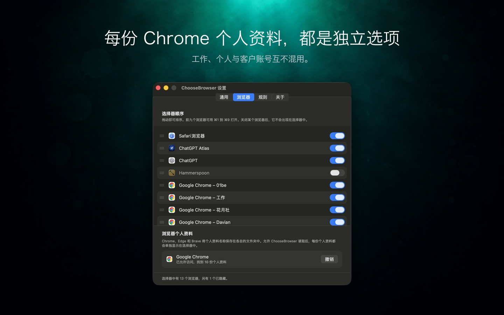

# chrome-use

[English](README.md) · **简体中文**

<p align="center">
  <a href="https://github.com/leeguooooo/chrome-use/releases"></a>
  <a href="https://github.com/leeguooooo/chrome-use/stargazers"></a>
  <a href="https://bot-detector.rebrowser.net/"></a>
  
  <a href="LICENSE"></a>
</p>

<p align="center"><i>⭐ 如果它帮你省掉了一次重新登录，点个 star 能让更多开发者找到它。</i></p>


<p align="center">
  
  <br>
  <sub>指向你<b>真实</b> Chrome 里的一个页面 → 一条命令拿到结构化数据。<a href="assets/demo.tape">（重新生成：<code>vhs assets/demo.tape</code>）</a></sub>
</p>

**chrome-use** 让任意 AI agent 直接操作你自己正在用的、已登录的 Chrome。它复用你的登录态，对反爬/反自动化系统**完全不可检测**，因为它**就是**你的真实浏览器。属于 `*-use` 家族（[iphone-use](https://github.com/leeguooooo/iphone-use) 驱动你的真实 iPhone，[bitwarden-use](https://github.com/leeguooooo/bitwarden-use) 从你的 Bitwarden 库里取密码、2FA 和 passkey，让 agent 用账号密码登录，chrome-use 驱动你的真实 Chrome）。

<sub>最初基于 [vercel-labs/agent-browser](https://github.com/vercel-labs/agent-browser)（Apache-2.0）；现已是独立项目。隐身/扩展中继架构、反检测、humanize、多 agent 隔离与 CLI 都已大幅分化。</sub>

> 📚 **文档站：** **[chrome-use.leeguoo.com](https://chrome-use.leeguoo.com)**：完整指南、工作流与命令参考（中文 · English）。
>
> 📖 **深入原理：** [让 agent 点进跨域 iframe：chrome-use 如何解决浏览器控制里最难的一环（English）](https://blog.leeguoo.com/en/posts/chrome-use-cross-origin-iframe/)
> · [让任何 AI Agent 直接驱动你已登录的真实 Chrome，CreepJS 给它打 0% bot](https://blog.leeguoo.com/zh/posts/chrome-use-drive-your-real-chrome/)

## 把你**已经登录好**的浏览器，交给你的 AI agent

**不用开新 Chrome。不用重新登录。不用跟"你是不是机器人"较劲。**

chrome-use 让**任意** agent（Claude Code、Cursor、Codex、你自己的脚本）直接操作你**已经登录了所有网站**的那个 Chrome。它在**你的窗口里**点击，你看着它干活，撞到 2FA / 验证码的瞬间你接管一下，它接着跑。因为它**就是你的真实浏览器**（一键装的扩展、原生消息、无调试端口），网站眼里它 100% 是人：**[CreepJS 实测 0% 机器人](#反检测)。**

**常规浏览器自动化**（Playwright / Puppeteer，或全新 `--launch`）启动的是空 profile 的全新浏览器：你得重新登录，网站也能看出是自动化。**chrome-use** 连接你**现有**的 Chrome：cookies、会话、浏览器指纹全是真的，因为它**就是**你的真实浏览器。从 **Chrome 136** 起，每次走裸 `--remote-debugging-port` 连接都会弹出一个阻塞式的 **"Allow remote debugging?"** 同意框。我们的扩展改用原生消息：**装一次，之后零确认。**

| | 常规自动化（Playwright · Puppeteer · browser-use） | web-access / 裸 CDP 端口 | [Claude in Chrome](https://www.anthropic.com/claude/chrome) | **chrome-use** |
|---|:---:|:---:|:---:|:---:|
| **任意** agent / CLI 都能用（不绑单一 app） | ✅ | ✅ | ❌ 仅 Claude | ✅ |
| 驱动你**真实、已登录**的 Chrome | ❌ 全新空 profile | ✅ | ✅ | ✅ |
| 连接方式 / **"Allow remote debugging?" 弹框** | —（自带浏览器） | `--remote-debugging-port` · **每次连都弹** 🔴 | `chrome.debugger` · 无 | 原生消息 · **从不** ✅ |
| 真实浏览器指纹（CreepJS ~0%）¹ | ❌ 自动化特征 / headless | ✅ | ✅ | ✅ **已实测 0%** |
| **无 `Runtime.enable` CDP 泄漏**（rebrowser）² | ❌ 泄漏 | ❌ 泄漏 | — | ✅ **默认关闭** |
| 多 agent 共用**同一个**真实 Chrome、标签组隔离³ | ❌ 各开各的浏览器 | ⚠️ 共享 tab、无隔离 | ❌ 单 app | ✅ |
| 权限面 | 完全控制 | 完整 CDP | 16 个，含 `<all_urls>` | **12 个，无 `<all_urls>`** |

<sub>¹ 三家「真实 Chrome」工具在 CreepJS 上都 ~0%（毕竟是真浏览器），我们的是实测过的。² rebrowser `runtimeEnableLeak`：我们的中继路径实测无泄漏；Claude in Chrome 未独立测试（—）。³ web-access 也能跑并行子 agent，但无每会话隔离；本工具每个 `--session` 拿到自己彩色、命令隔离的标签组。实测数字见 [反检测](#反检测)。</sub>

## 工作原理


你的 **chrome-use CLI** 通过 Chrome **原生消息（native messaging）** 和一个小**浏览器扩展**通信：这是本机进程间通道，**无网络端口、无 token、无远程服务器**。扩展用 `chrome.debugger` 驱动你指定的标签页（在你**已登录**的 Chrome 里），再把结果交还给 CLI。全程都在你本机。


每个 `--session` 拿到**自己的彩色标签组**，多个 agent 共用同一个真实浏览器、互不干扰，也不动你自己的标签页。省略 `--session` 时，chrome-use 会按支持的 runner id（包括 Codex 的 `CODEX_THREAD_ID`）派生稳定的 per-agent 会话；显式 `--session` / `AGENT_BROWSER_SESSION` 始终优先。会话命名、`session list` / `stop` / `prune`、所有权交接与 daemon 恢复见[会话指南](https://chrome-use.leeguoo.com/sessions.html)。

## 安装

```bash
curl -fsSL https://raw.githubusercontent.com/leeguooooo/chrome-use/main/install.sh | sh
```

从最新的 [GitHub Release](https://github.com/leeguooooo/chrome-use/releases) 下载对应平台的预编译二进制，安装 `chrome-use`（以及 `abs` 别名）。无需 npm，无需 token。

<details>
<summary>其他安装方式</summary>

- **锁定版本：** `AGENT_BROWSER_VERSION=v0.27.0-fork.12 curl -fsSL https://raw.githubusercontent.com/leeguooooo/chrome-use/main/install.sh | sh`
- **自定义路径：** `AGENT_BROWSER_BIN_DIR=$HOME/bin curl -fsSL … | sh`
- **Windows：** 从 [Releases 页](https://github.com/leeguooooo/chrome-use/releases) 下载 `chrome-use-win32-x64.tar.gz`，把 `chrome-use.exe` 放进 PATH。
- **npm（旧渠道）：** `npm install -g chrome-use`。仍在发布，但 GitHub Releases 现在是主渠道。
</details>

### 用 Nix 安装

免安装直接运行一次：`nix run github:leeguooooo/chrome-use -- --help`。
flake 同时提供 home-manager 模块和 NixOS 模块（`programs.chrome-use.enable = true`）；NixOS 上原生消息 host 是按用户注册的，切换后运行一次 `chrome-use extension connect`。
开发环境：`nix develop`（rust 工具链 + node 24 + pnpm + chromium + vhs）。
完整片段见[安装指南](https://chrome-use.leeguoo.com/install.html)。

### 安装 AI agent skill

**Claude Code，插件市场（推荐）：** 全局安装 skill（所有项目可见）、自动更新，并列出 [`*-use` 家族](https://github.com/leeguooooo/plugins)的其他成员：

```
/plugin marketplace add leeguooooo/plugins
/plugin install chrome-use@leeguooooo-plugins
```

**其他 agent runner（Cursor、Codex、自定义）：** 用 [skills.sh](https://skills.sh) 拉取 SKILL.md。加 `-g` 全局安装（每个项目可见）；不加则只装进当前项目：

```bash
npx skills add leeguooooo/chrome-use -g
```

> 上面的 `install.sh` 一行命令已经替你跑过这一步（用 `AGENT_BROWSER_NO_SKILL=1` 跳过）。只有跳过了安装器、或用非默认 agent runner 时才需要手动运行。

> **Codex 用户注意：** Codex 自带浏览器插件，遇到浏览器任务会优先选它。在一台装了很多 skill 的机器上实测，Codex 还会把每个 skill 的描述截到只剩几个字符（甚至没有），所以 skill 描述赢不了路由，在 prompt 里点名 `chrome-use` 也不够。有效的做法是在项目的 `AGENTS.md` 里加一行：
>
> ```
> Use the `chrome-use` CLI from the shell for every browser task; start with `chrome-use skills get core`. Do not use the built-in Chrome plugin for browser work here.
> ```

无论哪种方式，agent 都会拿到正确的用法和 `chrome-use` / `abs` 的预授权 bash 权限；二进制缺失时 skill 会自动重跑上面的 `install.sh` 一行命令来修复。专项指南（`electron`、`slack`、`agentcore` 等）由二进制自己通过 `chrome-use skills get <name>` 提供，所以说明永远和已安装版本一致。

升级二进制**不会**更新已经拷到 runner 里的 SKILL.md；那份副本在二进制之外。用 `chrome-use skills update` 刷新（`refresh` / `install` 是同一个命令；加 `--project` 装到 `./` 而不是全局）。

### 从 MCP 客户端使用（Claude Desktop 等）

对于**支持 MCP 但不能执行任意 shell 命令**的宿主（Claude Desktop、ChatGPT connectors、n8n/Dify），把 chrome-use 作为 MCP stdio server 写进 Claude Desktop 的 `claude_desktop_config.json`：

```json
{
  "mcpServers": {
    "chrome-use": { "command": "chrome-use", "args": ["mcp"] }
  }
}
```

## 连接你的 Chrome

从 Chrome 应用商店安装 [**chrome-use** 扩展](https://chromewebstore.google.com/detail/chrome-use/knfcmbamhjmaonkfnjhldjedeobeafmk)，再注册一次本地桥：

```bash
chrome-use extension install      # 注册原生消息 host（一次性）
chrome-use open https://x.com/home
chrome-use status                 # 中继、profile、扩展与会话健康总览
```

之后 `chrome-use open` 就通过**原生消息**驱动你真实、已登录的 Chrome：无调试端口、无 token、**永远不弹 "Allow remote debugging?"**。裸 remote-debugging 端口的备选方案（会弹同意框）见[真实 Chrome 指南](https://chrome-use.leeguoo.com/real-chrome.html)。

### 多 profile 的 Chrome：读 ChooseBrowser 的规则

同时开着工作号、个人号、客户号的人，心里本来就清楚「哪个站点用哪个账号」，只是每次都要用 `--browser` 再告诉我们一遍。[ChooseBrowser](https://choosebrowser.leeguoo.com) 是一个 macOS 链接路由工具，它把这份映射存了下来。装了它之后，`chrome-use open <url>` 在你没显式指定 `--browser` 时会按你自己写的规则选 profile，并且会说明来源：

```
$ chrome-use open https://github.com/my-org/repo
· using Chrome profile Profile 14 — a ChooseBrowser rule routes this site there
  (github.com|/my-org*). Override with --browser <id|email>, or skip with
  --no-choosebrowser.
```

只读，没装的话完全无感：没有规则文件就不改变任何行为、也不打任何提示。规则指向的 profile 如果没在跑扩展，会退回正常的 profile 选择逻辑。该回退不保证网站账号正确；需要特定账号时，应检查身份或显式指定 `--browser`。在显式 `--browser` 后面加 `--remember`，chrome-use 会请 ChooseBrowser 把规则写回去，由它自己的确认弹窗把关。

<a href="https://choosebrowser.leeguoo.com"></a>

**ChooseBrowser** 是 chrome-use 作者做的 macOS 链接路由器。设为默认浏览器之后，你点的每个链接都会先问一句：开在哪个浏览器、哪个 Chrome profile。

- Chrome、Edge、Brave、Vivaldi、Chromium 的每个 profile 都是独立的一行，工作、个人、客户账号各走各的。
- 规则可以匹配路径，不只看域名，同一个网站可以有两个去向。
- `⌘1`–`⌘9` 直接打开，`⌥↵` 记住一次，它还会学你在每个网站的偏好。
- 无账号、无跟踪、无统计。多台 Mac 同步走你自己的 iCloud，可选。

免费试用 7 天，之后 **US$4.99 一次性买断，最多 3 台 Mac**。公证过的 `.dmg`，需要 macOS 26 或更高。[下载](https://choosebrowser.leeguoo.com) · [完整介绍](https://chrome-use.leeguoo.com/choosebrowser.html)。chrome-use 不依赖它。

<br clear="all">

## 用法

核心循环：打开、读取、操作、只重读变化的部分。

```bash
chrome-use open https://example.com    # 连接你的 Chrome 并导航
chrome-use snapshot -i                 # 每次交互的起点：带 @ref 的可交互元素
chrome-use click @e3 --observe         # 操作，并观察页面的反应
chrome-use snapshot -i --diff          # 只回传相对上一张快照变化的部分
```

Agent 在你的 Chrome 里操作：你能实时看到开标签、加载、点击。任意时刻都能接管（比如手动过验证码），然后让 agent 继续。

| 命令 | 用途 |
|---|---|
| `chrome-use open <url>` | 连接你的 Chrome 并导航 |
| `chrome-use snapshot -i` | 读页面；每次交互的起点 |
| `chrome-use click "Post"` · `click @e3` · `click 449 320` | 按文本、按快照 ref、或按视口坐标点击 |
| `chrome-use fill "Title" "Hello World"` · `type @e3 "text"` | `fill` 整体替换，`type` 追加 |
| `chrome-use screenshot ./page.png` | 保存截图（截图是用来看和附上的输出，不是 agent 读页面的方式） |
| `chrome-use find "edit web service settings button"` | 按自然语言描述返回排序后的候选，不自动执行 |
| `chrome-use actions @e15` · `do @e15 expand` | 这个元素此刻支持什么，并只做其中之一 |
| `chrome-use tab list` · `tab select t2` · `tab adopt <url-substring\|targetId>` | 列出标签；选择已创建或已接管的标签；不导航地接管已打开的标签 |
| `chrome-use dialog status` · `dialog accept\|dismiss` | 处理点击触发的原生 `confirm()` / `prompt()` |
| `chrome-use download @e2 ./video.mp4` | 用已登录浏览器的同一份 cookie 下载，且不导航当前标签页 |
| `chrome-use network route "*/api/me" --body '{"vip":true}'` | 伪造响应、改写出站请求或拦截请求 |
| `chrome-use site github/issues epiral/bb-browser --json` | 运行站点适配器，从网站自己的接口拿干净的 JSON |
| `chrome-use session list` · `session stop [name]` | 管理会话 worker |
| `chrome-use status` | 中继、profile、扩展与会话健康总览 |

## 反检测


连接你真实 Chrome 时，我们**零** JS 注入。浏览器指纹完全是真的。指导原则是 **native CDP/Chrome 覆盖优先于 JS 谎言**：被重定义的 getter 本身可被检测，原生覆盖则不会。

- `navigator.webdriver = false` 走 `Emulation.setAutomationOverride`（原生，CreepJS 类说谎检测查不出）。
- **`Runtime.enable` 默认关闭。** 活着的 `Runtime` 域是可被检测的 CDP 信号（patchright/rebrowser 的 "runtime leak"），即便连的是你真实 Chrome。只在你主动开启 console/错误捕获时才启用。`click`、`fill`、`eval` 等不需要它。

**实测结果（连接真实 Chrome）：**

| 检测站 | 结果 |
|---|---|
| [CreepJS](https://abrahamjuliot.github.io/creepjs/) | **0% stealth · 0% headless**（零 override 痕迹） |
| [bot.incolumitas.com](https://bot.incolumitas.com/) | 全部 OK：`overflowTest`、`overrideTest`、`puppeteerExtraStealthUsed`、worker 一致性 |
| [bot.sannysoft.com](https://bot.sannysoft.com) | 全绿 |
| [BrowserScan](https://www.browserscan.net/bot-detection) | Webdriver · User-Agent · CDP 全部干净 |
| [Cloudflare Turnstile](https://nowsecure.nl) | 通过 |

CreepJS 上的 `0% stealth` 是关键数字：因为连接路径**什么都不打补丁**，根本没有可供说谎检测器抓的 override。（读 `navigator.languages` 顺序或 IP 地理位置的面板可能给个软性的「navigator」/「location」标记。那反映的是*你真实 Chrome* 的语言列表和网络，不是自动化破绽。）

`--launch` 独立模式（全新浏览器）会改用一整套隐身补丁，也能过上述检测，唯一例外：CreepJS 报 **~20% stealth**，因为 srcdoc-iframe 的 `contentWindow` 补丁触发了它的 `hasIframeProxy` 探测（用来藏自动化的 proxy 本身成了破绽）。其余全干净（`0% headless`、sannysoft/browserscan 全绿、Cloudflare 通过）。设 **`AGENT_BROWSER_DISABLE_IFRAME_PROXY=1`** 去掉那个补丁即可拿到干净的 **0% stealth**（代价是放弃小众的 srcdoc-iframe 遮蔽）。**扩展连接路径**（你的真实 Chrome）零 JS 注入、不受影响，它才是货真价实的 0% 路径。

### 自己验证

别光听我们说。把你连接的 Chrome 指向最硬的公开检测器，自己对比：

- **[CreepJS](https://abrahamjuliot.github.io/creepjs/)**：最全面的指纹 / 说谎检测器
- **[bot.incolumitas.com](https://bot.incolumitas.com/)**：行为 + 指纹打分，方法公开
- **[BrowserScan](https://www.browserscan.net/bot-detection)**：Webdriver / User-Agent / CDP / Navigator
- **[bot.sannysoft.com](https://bot.sannysoft.com)**：经典自动化特征清单
- **[pixelscan.net](https://pixelscan.net/)** · **[iphey.com](https://iphey.com/)**：一致性与身份

我们故意**不自带 bot 检测器**。最强、最诚实的基准，就是拿市面上最好的检测器去测你的真实浏览器。

## 文档里还有

- [站点适配器](https://chrome-use.leeguoo.com/site-adapters.html)：把一个网站变成「结构化数据 CLI」（`chrome-use site`）
- [自动化测试](https://chrome-use.leeguoo.com/testing.html)：用 `chrome-use test` 跑可重跑的 YAML 套件
- [无障碍审计](https://chrome-use.leeguoo.com/commands.html)：`chrome-use a11y` 运行 axe-core
- [更省字节地读页面](https://chrome-use.leeguoo.com/reading.html)：`snapshot -i --diff`、`--max-bytes`、`--from`
- [读之前的等待](https://chrome-use.leeguoo.com/waiting.html)：settle 检测、`--settle-ms`、`--with-screenshot`
- [在字段内部编辑，以及带格式粘贴](https://chrome-use.leeguoo.com/interacting.html)：`select-text`、`paste --format html`
- [点击之外的动作](https://chrome-use.leeguoo.com/interacting.html)：`actions`、`do expand|showMenu|increment`
- [查找元素与稳定 ref](https://chrome-use.leeguoo.com/finding.html)：`find`、XPath、shadow DOM ref
- [下载](https://chrome-use.leeguoo.com/interacting.html)：`download`、`download-url`、`downloads`
- [本地 HTTP API](https://chrome-use.leeguoo.com/http-api.html)：每个会话 stream 端口上的版本化 `/api/v1` 接口
- [网络拦截](https://chrome-use.leeguoo.com/network.html)：`network route` 伪造、改写或拦截
- [类人输入（humanize）](https://chrome-use.leeguoo.com/stealth.html)：`--humanize off|fast|human`，自适应反爬升档
- [静默操作](https://chrome-use.leeguoo.com/real-chrome.html)：后台标签，绝不抢你的前台标签
- [调参](https://chrome-use.leeguoo.com/commands.html)：`AGENT_BROWSER_*` 环境变量
- [独立模式（`--launch`）](https://chrome-use.leeguoo.com/real-chrome.html)：全新隔离浏览器，`--profile auto` 保留登录
- [标签、对话框与会话](https://chrome-use.leeguoo.com/commands.html)：`tab duplicate|select|adopt|inspect`、`dialog`、`session handoff`
- [MCP server](https://chrome-use.leeguoo.com/mcp.html)：`chrome-use mcp`、`--tools all`
- [排障](https://chrome-use.leeguoo.com/troubleshooting.html)

<!-- use-family -->
## `*-use` 家族

一组小而互相独立的 CLI，各自把 agent 的手伸到一个真实的东西上。装法都一样：
`curl … install.sh | sh` 装命令，`npx skills add leeguooooo/<name>` 教会 agent，输出都是 JSON。

| 仓库 | 给 agent 的能力 |
|---|---|
| [mail-use](https://github.com/leeguooooo/mail-use) | 邮箱：读、搜、发、清理，Gmail / QQ / 163 / 任意 IMAP |
| [iphone-use](https://github.com/leeguooooo/iphone-use) | 一台真 iPhone：点按、输入、截屏、导出手机上的数据 |
| [wechat-use](https://github.com/leeguooooo/wechat-use) | macOS 微信：发消息、查联系人和聊天记录 |
| [discord-use](https://github.com/leeguooooo/discord-use) | Discord：消息、频道、论坛、webhook（纯 REST，Rust） |
| [cookie-use](https://github.com/leeguooooo/cookie-use) | 同一站点的多个登录态：抓取、切换、注入 |
| [profile-use](https://github.com/leeguooooo/profile-use) | 本地个人资料：安全地填注册 / KYC / 结账表单 |
| [bitwarden-use](https://github.com/leeguooooo/bitwarden-use) | Bitwarden / Vaultwarden：无头 passkey（FIDO2）登录 |
| [chatgpt-use](https://github.com/leeguooooo/chatgpt-use) | 把 ChatGPT 订阅当成编码 agent 的后端，不用 API key |
| [computer-use](https://github.com/leeguooooo/computer-use) | macOS 桌面本身 |
| [pixcake-use](https://github.com/leeguooooo/pixcake-use) | 只读探查 PixCake：快照 / diff / SQLite 检查 |

## 参与开发

`AGENTS.md` 是这个仓库的约定：文档放在哪、怎么构建和测试，以及两条用教训换来的
规矩：绝不发出假成功、怎么诚实地做性能测量。进行中的工作在
[issues](https://github.com/leeguooooo/chrome-use/issues) 里追踪。

感谢每一位为 chrome-use 做出贡献的人！

<a href="https://github.com/leeguooooo/chrome-use/graphs/contributors">
  
</a>

## License

Apache-2.0

---

> 由 **leeguooooo** 打造。AI agent、逆向工程与 Cloudflare Workers 的实战笔记见 **[blog.leeguoo.com](https://blog.leeguoo.com)** · 关注 **[X @leeguooooo](https://x.com/leeguooooo)**
