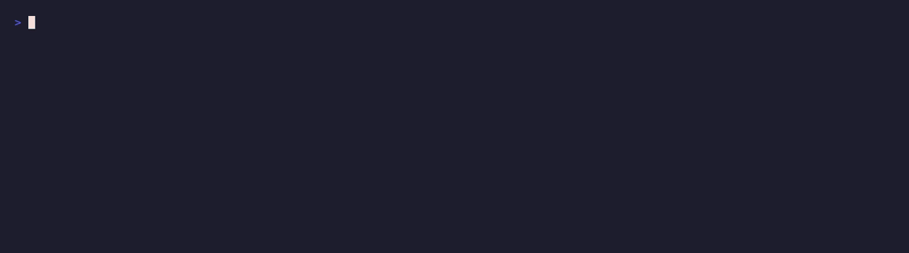
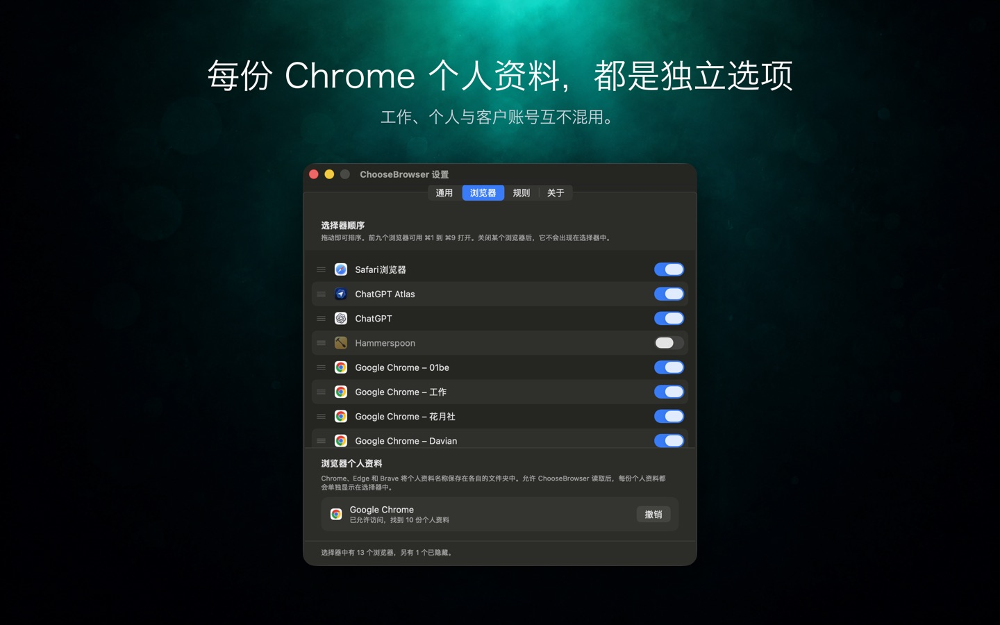

# chrome-use

[English](README.md) · **简体中文**

<p align="center">
  <a href="https://github.com/leeguooooo/chrome-use/releases"></a>
  <a href="https://github.com/leeguooooo/chrome-use/stargazers"></a>
  <a href="https://bot-detector.rebrowser.net/"></a>
  
  <a href="LICENSE"></a>
</p>

<p align="center"><i>⭐ 如果它帮你省掉了一次重新登录，点个 star 能让更多开发者找到它。</i></p>


<p align="center">
  
  <br>
  <sub>指向你<b>真实</b> Chrome 里的一个页面 → 一条命令拿到结构化数据。<a href="assets/demo.tape">（重新生成：<code>vhs assets/demo.tape</code>）</a></sub>
</p>

**chrome-use** 让任意 AI agent 直接操作你自己正在用的、已登录的 Chrome。它复用你的登录态，保留现有浏览器配置；公开检测结果见下文，不代表所有网站都无法识别自动化。属于 `*-use` 家族（[iphone-use](https://github.com/leeguooooo/iphone-use) 驱动你的真实 iPhone，[bitwarden-use](https://github.com/leeguooooo/bitwarden-use) 从你的 Bitwarden 库里取密码、2FA 和 passkey，让 agent 用账号密码登录，chrome-use 驱动你的真实 Chrome）。

<sub>最初基于 [vercel-labs/agent-browser](https://github.com/vercel-labs/agent-browser)（Apache-2.0）；现已是独立项目。隐身/扩展中继架构、反检测、humanize、多 agent 隔离与 CLI 都已大幅分化。</sub>

> 📚 **文档站：** **[chrome-use.leeguoo.com](https://chrome-use.leeguoo.com)**：完整指南、工作流与命令参考（中文 · English）。
>
> 📖 **深入原理：** [让 agent 点进跨域 iframe：chrome-use 如何解决浏览器控制里最难的一环（English）](https://blog.leeguoo.com/en/posts/chrome-use-cross-origin-iframe/)
> · [让任何 AI Agent 直接驱动你已登录的真实 Chrome，CreepJS 给它打 0% bot](https://blog.leeguoo.com/zh/posts/chrome-use-drive-your-real-chrome/)

## 把你**已经登录好**的浏览器，交给你的 AI agent

**不用开新 Chrome。不用重新登录。不用跟"你是不是机器人"较劲。**

chrome-use 让**任意** agent（Claude Code、Cursor、Codex、你自己的脚本）直接操作你**已经登录了所有网站**的那个 Chrome。它在**你的窗口里**点击，你看着它干活，撞到 2FA / 验证码的瞬间你接管一下，它接着跑。因为它**就是你的真实浏览器**（一键装的扩展、原生消息、无调试端口），在公开 CreepJS 测试中：**[CreepJS 实测 0% 机器人](#反检测)。**

**新建浏览器上下文**没有现有登录态。Playwright / Puppeteer 也支持持久化配置或已有浏览器连接，需要比较实际配置。**chrome-use** 连接你**现有**的 Chrome：cookies、会话、浏览器指纹全是真的，因为它**就是**你的真实浏览器。Chrome 136 限制默认配置文件的远程调试；授权要求随 Chrome 版本和连接方式而变。我们的扩展改用原生消息：**装一次，之后零确认。**

| | 常规自动化（Playwright · Puppeteer · browser-use） | web-access / 裸 CDP 端口 | [Claude in Chrome](https://www.anthropic.com/claude/chrome) | **chrome-use** |
|---|:---:|:---:|:---:|:---:|
| **任意** agent / CLI 都能用（不绑单一 app） | ✅ | ✅ | ❌ 仅 Claude | ✅ |
| 驱动你**真实、已登录**的 Chrome | 可配置；新上下文默认无登录态 | ✅ | ✅ | ✅ |
| 连接方式 / **"Allow remote debugging?" 弹框** | —（自带浏览器） | `--remote-debugging-port` · 取决于版本和模式 | `chrome.debugger` · 无 | 原生消息 · **从不** ✅ |
| 真实浏览器指纹（CreepJS ~0%）¹ | ❌ 自动化特征 / headless | ✅ | ✅ | ✅ **已实测 0%** |
| **无 `Runtime.enable` CDP 泄漏**（rebrowser）² | ❌ 泄漏 | ❌ 泄漏 | — | ✅ **默认关闭** |
| 多 agent 共用**同一个**真实 Chrome、标签组隔离³ | ❌ 各开各的浏览器 | ⚠️ 共享 tab、无隔离 | ❌ 单 app | ✅ |
| 权限面 | 完全控制 | 完整 CDP | 16 个，含 `<all_urls>` | **12 个，无 `<all_urls>`** |

<sub>¹ 三家「真实 Chrome」工具在 CreepJS 上都 ~0%（毕竟是真浏览器），我们的是实测过的。² rebrowser `runtimeEnableLeak`：我们的中继路径实测无泄漏；Claude in Chrome 未独立测试（—）。³ web-access 也能跑并行子 agent，但无每会话隔离；本工具每个 `--session` 拿到自己彩色、命令隔离的标签组。实测数字见 [反检测](#反检测)。</sub>

## 工作原理


你的 **chrome-use CLI** 通过 Chrome **原生消息（native messaging）** 和一个小**浏览器扩展**通信：这是本机进程间通道，**无网络端口、无 token、无远程服务器**。扩展用 `chrome.debugger` 驱动你指定的标签页（在你**已登录**的 Chrome 里），再把结果交还给 CLI。全程都在你本机。


每个 `--session` 拿到**自己的彩色标签组**，多个 agent 共用同一个真实浏览器、互不干扰，也不动你自己的标签页。省略 `--session` 时，chrome-use 会按支持的 runner id（包括 Codex 的 `CODEX_THREAD_ID`）派生稳定的 per-agent 会话；显式 `--session` / `AGENT_BROWSER_SESSION` 始终优先。会话命名、`session list` / `stop` / `prune`、所有权交接与 daemon 恢复见[会话指南](https://chrome-use.leeguoo.com/sessions.html)。

## 安装

**macOS / Linux**

```bash
curl -fsSL https://raw.githubusercontent.com/leeguooooo/chrome-use/main/install.sh | sh
```

**Windows**（PowerShell）

```powershell
irm https://raw.githubusercontent.com/leeguooooo/chrome-use/main/install.ps1 | iex
```

从最新的 [GitHub Release](https://github.com/leeguooooo/chrome-use/releases) 下载对应平台的预编译二进制，安装 `chrome-use`（以及 `abs` 别名）。无需 npm，无需 token。

<details>
<summary>其他安装方式</summary>

- **锁定版本：** `AGENT_BROWSER_VERSION=v0.27.0-fork.12 curl -fsSL https://raw.githubusercontent.com/leeguooooo/chrome-use/main/install.sh | sh`
- **自定义路径：** `AGENT_BROWSER_BIN_DIR=$HOME/bin curl -fsSL … | sh`
- **Windows 锁定版本或安装位置：** 在 `irm … | iex` 前先设置 `$env:AGENT_BROWSER_VERSION = 'v1.5.139'` 或 `$env:AGENT_BROWSER_BIN_DIR = 'D:\tools'`。默认装到 `%LOCALAPPDATA%\Programs\chrome-use` 并加入用户 PATH，原有条目原样保留（不想改 PATH 就设 `$env:AGENT_BROWSER_NO_PATH = 1`）。不需要管理员权限。
- **Windows 手动安装：** 从 [Releases 页](https://github.com/leeguooooo/chrome-use/releases) 下载 `chrome-use-win32-x64.tar.gz` 和对应的 `.sha256`，确认 `(Get-FileHash chrome-use-win32-x64.tar.gz -Algorithm SHA256).Hash` 与 `.sha256` 文件一致，用 `tar -xzf chrome-use-win32-x64.tar.gz` 解压，再把 `chrome-use.exe` 放进 PATH。运行前一定先对哈希：下载中断的包照样能解压出 `.exe`，它会在启动时报访问违规（退出码 `-1073741819`，即 `0xC0000005`），而不会提示下载不完整。
</details>

### 用 Nix 安装

免安装直接运行一次：`nix run github:leeguooooo/chrome-use -- --help`。
flake 同时提供 home-manager 模块和 NixOS 模块（`programs.chrome-use.enable = true`）；NixOS 上原生消息 host 是按用户注册的，切换后运行一次 `chrome-use extension connect`。
开发环境：`nix develop`（rust 工具链 + node 24 + pnpm + chromium + vhs）。
完整片段见[安装指南](https://chrome-use.leeguoo.com/install.html)。

### 安装 AI agent skill

使用新版 CLI 时，安装脚本直接安装并校验内置的发现入口，不需要 Node、npx、Git 或额外下载。手动安装或刷新：

```bash
chrome-use skill install
chrome-use skill install --project
```

全局安装覆盖 `~/.agents/skills`、Claude Code、Codex 和 Cursor，以及检测到配置目录的 Pi、OpenCode、Windsurf、CodeBuddy 和 Trae；遵循 `CLAUDE_CONFIG_DIR`、`XDG_CONFIG_HOME`。项目安装写入 `.agents/skills`、`.claude/skills`，以及已有的 `.pi`、`.windsurf`、`.codebuddy`、`.trae` 配置目录。安装后重启 agent 或重新加载技能。任一目录写入失败都会报错，即使其他目录已成功。详见[安装说明](https://chrome-use.leeguoo.com/install.html)。

**Claude Code，插件市场（推荐）：** 全局安装 skill（所有项目可见）、自动更新，并列出 [`*-use` 家族](https://github.com/leeguooooo/plugins)的其他成员：

```
/plugin marketplace add leeguooooo/plugins
/plugin install chrome-use@leeguooooo-plugins
```

**更多 runner：** 内置目录映射之外的 runner 仍可通过 [skills.sh](https://skills.sh) 安装；这条可选路径需要 Node 及其自身依赖：

```bash
npx skills add leeguooooo/chrome-use -g
```

> 上面的一行安装命令已安装内置技能，可用 `AGENT_BROWSER_NO_SKILL=1` 跳过。PowerShell 安装脚本也能从固定的旧版 CLI 提取技能，绕过旧版的 npx 安装逻辑。安装错误会中止完成提示；脚本完成不代表 Chrome 扩展已经连通。

> **Codex 用户注意：** Codex 自带浏览器插件，遇到浏览器任务会优先选它。在一台装了很多 skill 的机器上实测，Codex 还会把每个 skill 的描述截到只剩几个字符（甚至没有），所以 skill 描述赢不了路由，在 prompt 里点名 `chrome-use` 也不够。有效的做法是在项目的 `AGENTS.md` 里加一行：
>
> ```
> Use the `chrome-use` CLI from the shell for every browser task; start with `chrome-use skills get core`. Do not use the built-in Chrome plugin for browser work here.
> ```

无论哪种方式，agent 都会拿到正确的用法和 `chrome-use` / `abs` 的预授权 bash 权限；二进制缺失时 skill 会自动重跑上面对应平台的一行安装命令来修复。专项指南（`electron`、`slack`、`agentcore` 等）由二进制自己通过 `chrome-use skills get <name>` 提供，所以说明永远和已安装版本一致。

升级二进制**不会**更新已经拷到 runner 里的 SKILL.md；那份副本在二进制之外。`chrome-use upgrade` 两样都管：先装最新的 GitHub Release，再逐个刷新找到的 skill 副本（Claude Code 插件、git checkout、安装脚本写入的目录；`npx skills add` 拷的副本会提示运行 `npx skills update chrome-use`）。`chrome-use upgrade --check`（或 `--json`）什么都不改，只报告当前版本、最新版本和 skill 装在哪；退出码 2 表示检查失败。其他命令每天最多在后台检查一次；只要有新版本，每次运行都会往 stderr 打一行提示；设 `CHROME_USE_NO_UPDATE_CHECK=1` 或全家通用的 `USE_NO_UPDATE_CHECK=1` 可关闭。只刷新 skill 用 `chrome-use skills update`（`refresh` / `install` 是同一个命令；加 `--project` 装到 `./` 而不是全局）。

### 从 MCP 客户端使用（Claude Desktop 等）

对于**支持 MCP 但不能执行任意 shell 命令**的宿主（Claude Desktop、ChatGPT connectors、n8n/Dify），把 chrome-use 作为 MCP stdio server 写进 Claude Desktop 的 `claude_desktop_config.json`：

```json
{
  "mcpServers": {
    "chrome-use": { "command": "chrome-use", "args": ["mcp"] }
  }
}
```

## 连接你的 Chrome

从 Chrome 应用商店安装 [**chrome-use** 扩展](https://chromewebstore.google.com/detail/chrome-use/knfcmbamhjmaonkfnjhldjedeobeafmk)，再注册一次本地桥：

```bash
chrome-use extension install      # 注册原生消息 host（一次性）
chrome-use open https://x.com/home
chrome-use status                 # 中继、profile、扩展与会话健康总览
```

之后 `chrome-use open` 就通过**原生消息**驱动你真实、已登录的 Chrome：无调试端口、无 token、**永远不弹 "Allow remote debugging?"**。裸 remote-debugging 端口的备选方案（会弹同意框）见[真实 Chrome 指南](https://chrome-use.leeguoo.com/real-chrome.html)。

### 多 profile 的 Chrome：读 ChooseBrowser 的规则

同时开着工作号、个人号、客户号的人，心里本来就清楚「哪个站点用哪个账号」，只是每次都要用 `--browser` 再告诉我们一遍。[ChooseBrowser](https://choosebrowser.leeguoo.com) 是一个 macOS 链接路由工具，它把这份映射存了下来。装了它之后，`chrome-use open <url>` 在你没显式指定 `--browser` 时会按你自己写的规则选 profile，并且会说明来源：

```
$ chrome-use open https://github.com/my-org/repo
· using Chrome profile Profile 14 — a ChooseBrowser rule routes this site there
  (github.com|/my-org*). Override with --browser <id|email>, or skip with
  --no-choosebrowser.
```

只读，没装的话完全无感：没有规则文件就不改变任何行为、也不打任何提示。规则是硬约束：chrome-use 不会把这个站点开到别的 profile 里。规则指向的 profile 没连上时，命令直接失败，并给出 `chrome-use connect --browser <profile>`；当前 session 已经绑定在另一个 profile 上时，命令同样失败，提示换一个新的 `--session` 或加 `--no-choosebrowser`。显式 `--browser` 和配置文件里的路由仍然优先。这条检查同样覆盖 `batch` 的每一步、MCP 工具调用和 script 步骤。规则指向的 profile 在本机已不存在时只给警告，不拦截。`chrome-use doctor` 会逐条列出规则，以及它指向的 profile 现在是否已连接。在显式 `--browser` 后面加 `--remember`，chrome-use 会请 ChooseBrowser 把规则写回去，由它自己的确认弹窗把关。

<a href="https://choosebrowser.leeguoo.com"></a>

**ChooseBrowser** 是 chrome-use 作者做的 macOS 链接路由器。设为默认浏览器之后，你点的每个链接都会先问一句：开在哪个浏览器、哪个 Chrome profile。

- Chrome、Edge、Brave、Vivaldi、Chromium 的每个 profile 都是独立的一行，工作、个人、客户账号各走各的。
- 规则可以匹配路径，不只看域名，同一个网站可以有两个去向。
- `⌘1`–`⌘9` 直接打开，`⌥↵` 记住一次，它还会学你在每个网站的偏好。
- 无账号、无跟踪、无统计。多台 Mac 同步走你自己的 iCloud，可选。

免费试用 7 天，之后 **US$4.99 一次性买断，最多 3 台 Mac**。公证过的 `.dmg`，需要 macOS 26 或更高。[下载](https://choosebrowser.leeguoo.com) · [完整介绍](https://chrome-use.leeguoo.com/choosebrowser.html)。chrome-use 不依赖它。

<br clear="all">

已安装的发现入口应引导 agent 执行 `chrome-use skills get core`，不应另带一套命令手册。若旧副本只有自己的操作说明而没有这一步，应先用 `chrome-use skills update` 刷新入口，再比较 core 指南的变化。

## 用法

等待条件超时本身不能判断浏览器是否断线。`wait --text` 按区分大小写的子串匹配，需使用页面实际文案；所需回执已经出现时，不要重复等待。

`chrome-use skills get core` 包含日常操作循环和普通表单命令。按任务需要加载 `core/reading`、`core/connection` 或 `core/site-adapters`；普通点击不必另读 reference。每次只读取能回答下一步问题的状态，页面给出足以确认目标的信号后就停止验证。

核心循环：打开、读取、操作、只重读变化的部分。

```bash
chrome-use open https://example.com    # 连接你的 Chrome 并导航
chrome-use snapshot -i                 # 每次交互的起点：带 @ref 的可交互元素
chrome-use click @e3 --observe         # 操作，并观察页面的反应
chrome-use snapshot -i --diff          # 只回传相对上一张快照变化的部分
```

用 `snapshot -i -c` 精简控件视图，已知区域用 scoped read；只有上一次观察还留下问题时才用 `--diff`。已知动作序列用 `batch`（每一步可以带自己的 `--observe`：`batch "fill @e1 Ada" "click @e2 --observe"`；`pick` 和 `click` 一样可以观察），有条件分支的 observe/decide/act/verify 流程用 `script`，多个字段用 `form fill --map`，最后核验任务要求的结果：`observed.status: complete` 只表示这次捕获完整，不表示任务完成，要等页面自己的最终信号（`wait --text`）。元素截图写成 `screenshot <selector> <path>` 或 `screenshot <path> --selector <selector>`。只有树无法回答视觉问题时才加 `--with-screenshot <path>`。

语义 `find role/text/label/placeholder/alt/title/testid` 要求恰好一个可见匹配，只定位不操作时也一样。多个匹配会返回最多八个候选及可见状态、选择器和上下文提示，不派发动作，也不输出输入框的值。用 `--name`/`--exact` 消歧，或用 `--within <CSS|@ref>` 限定到唯一容器。范围必须属于当前标签页的主文档，跨 iframe 的 ref 和已选中的 iframe 上下文会被拒绝；可用 iframe 内的直接 ref 动作，或先 `frame main`。`find first/last/nth` 保留显式按序选择；普通 CSS 动作行为不变。role 和 label 名称来自 Chrome 无障碍数据，包含 `aria-labelledby`；每次语义调用重新定位。派发前目标已脱离时安全失败，结果不确定的动作不会重放。

现有 `mcp --tools all` 的 `chrome_use_find` 工具接受 `within`，使用相同的唯一范围规则，工具数量不变。fill/type 的 `text` 按文字原样传入，`--name --observe` 不会被当作 CLI 参数。

语义 find 的 `--observe` 仍按已有行为提示不支持；已知范围和回执时可在同一个 `batch` 中执行范围内 find 动作及任务专属的 `get text` 核验。MCP find 工具不声明 observe 字段。

先从页面发现范围：`find query "Beta account"` 返回候选的选择器锚点；选出对应标题的 article/容器，再执行 `find role button click --name Save --exact --within "<返回的选择器>"`。范围有歧义时用 `snapshot -s "<选择器>"` 查看并缩小范围，不取第一个。未知语义 find 参数和重复 `--within` 会被拒绝；输入像参数的文字可写 `find label Email fill -- --name`。`--exact false` 使用子串匹配。


同一目标和页面连续三次相同的 `click`、`dblclick` 或 `press`，相邻间隔不超过 60 秒，且完整、稳定的观察没有发现树、请求、资源或 frame 活动时，`observed.noProgress` 会提示检查状态或等待任务所需的条件。它不改变动作 success，不证明写入失败，也不会重试。

普通 CLI/MCP 准备连接时，只有成功复用同一浏览器连接、目标和会话，且未加载 storage state，才会保留连续计数。新浏览器、重新绑定、准备失败或加载 storage state 仍会清空计数。

脚本在 `advisories`（CLI `script --json` 顶层；daemon envelope 中为 `data.advisories`） 中保留提示，最多 20 条，嵌套脚本和后续失败的运行也会保留。JSON op-list 的对应 `steps` 条目另带 `noProgress`；文字输出只打印汇总提示一次。JS 脚本失败时保留 `ok:false`、`return:null`、`error`、`logs` 和 `advisories`。daemon envelope 中嵌套脚本的 `data.ok:false` 会使父脚本失败，即使传输层 `success` 为 true；调度成功不能证明程序成功。

普通 CLI `--json` 返回 `success`/`data`/`timing` envelope。`batch --json` 打印 `{command,success,result,error}` 条目的数组；`script --json` 打印程序结果本身（`ok`、`return`、`logs`、`error`、`advisories` 等）。batch 和 script 的 CLI 输出没有顶层 `timing`。

JSON 命令计时包含 `cdpMs`（已完成前台 CDP 请求耗时之和）、`cdpBusyMs`（请求时间区间在命令总耗时内的并集）和 `nonCdpMs`（总耗时减去并集）。请求并发时 `cdpMs` 可以超过总耗时；这些都是经过时间，不是 CPU 占用。后台任务不继承计时器，`nonCdpMs` 也不等于纯 daemon 处理时间。tool/HTTP 调用数不能当成模型回合，模型回合需要调用方 trace。任务测量见[核心循环](https://chrome-use.leeguoo.com/core-loop.html#task-efficiency)。

Agent 在你的 Chrome 里操作：你能实时看到开标签、加载、点击。任意时刻都能接管（比如手动过验证码），然后让 agent 继续。

任务已获授权时，内置 skill 要求 agent 先识别并尝试普通验证码：易盾普通和旋转拼图用 `solve-slider`，能看清的图标点选用截图识别顺序并点击，核验页面结果后继续。用 `chrome-use skills get core/captcha` 加载流程。重试有次数限制；识别不清或缺少操作能力时才交接。这不代表所有厂商和题型都能解开。先激活目标标签再截图取坐标；验证码厂商返回成功或重发倒计时不走，都不能证明网站已接受验证。

| 命令 | 用途 |
|---|---|
| `chrome-use open <url>` | 连接你的 Chrome 并导航 |
| `chrome-use snapshot -i` | 读页面；每次交互的起点 |
| `chrome-use click "Post"` · `click @e3` · `click 449 320` | 按文本、按快照 ref、或按视口坐标点击 |
| `chrome-use fill "Title" "Hello World"` · `type @e3 "text"` | `fill` 整体替换，`type` 追加，都用可信输入事件；页面没反应时（比如保存按钮一直禁用）给出 ⚠ 警告 |
| `chrome-use network request <id>` | 从请求所属页面或跨源帧读取响应正文；正文不可用时返回 `responseBodyError` |
| `chrome-use screenshot ./page.png` | 保存视觉证据；图片验证码和 canvas 目标用截图，普通控件用 ref |
| `chrome-use solve-slider 1` · `skills get core/captcha` | 尝试易盾拼图（未通过时非零退出）；加载点选与结果核验流程 |
| `chrome-use find "edit web service settings button"` | 按自然语言描述返回排序后的候选，不自动执行 |
| `chrome-use actions @e15` · `do @e15 expand` | 这个元素此刻支持什么，并只做其中之一 |
| `chrome-use click @e2 --follow` | 点击打开的新标签（`target=_blank`、`window.open`）以 `openedTab` 报告并归入会话；`--follow` 切过去。在你自己的 Chrome 里只接管由本会话标签打开的标签，并按标签 id 附加（需要 ab-connect 0.5.30+）；否则由 `openedTabWarning` / `openedTabStatus`（`unadopted`、`unknown`）说明原因 |
| `chrome-use tab list` · `tab select t2` · `tab adopt <url-substring\|targetId>` | 列出标签；选择已创建或已接管的标签；通过扩展或直接 CDP 连接，不导航地接管已打开的标签 |
| `chrome-use tab new [url] --activate` · `tab select t2 --activate` · `tab adopt <targetId> --activate` | 在初始化或存活探针之前激活目标；`--front` 是别名 |
| `chrome-use dialog status` · `dialog accept\|dismiss` | 处理点击触发的原生 `confirm()` / `prompt()` |
| `chrome-use download @e2 ./video.mp4` | 用已登录浏览器的同一份 cookie 下载，且不导航当前标签页 |
| `chrome-use network route "*/api/me" --body '{"vip":true}'` | 伪造响应、改写出站请求或拦截请求 |
| `chrome-use site github/issues epiral/bb-browser --json` | 运行站点适配器，从网站自己的接口拿干净的 JSON |
| `chrome-use session list` · `session stop [name]` | 管理会话 worker |
| `chrome-use auth login --bwu [--item <id\|name>]` | 从 Bitwarden 填写当前登录页，处理 TOTP 和支持的 passkey 两步验证 |
| `chrome-use auth login --bwu --passkey` | 在 `--launch` 浏览器中用 passkey 登录（bwu 0.9.0+） |
| `chrome-use status` | 中继、profile、扩展与会话健康总览；用最长 10 秒的扩展响应探测验证连接 |

输入框里显示了你的文字，不代表页面已经记下。`fill` 发现表单的保存/提交按钮在填写前后都处于禁用时会警告；
`click` 拒绝点击禁用的控件，退回到不可信的 `element.click()` 时会报告 `dispatch: dom`；
`snapshot` 会把内嵌勾选框的按钮标成 `[toggles=checkbox(checked=true)]`，因为点它会切换设置
（在 LinkedIn 的档案语言弹窗里，这会删除该语言的档案）。

新建、选择与接管标签默认在后台进行，默认命令不会把 Chrome 提到前台，也不会切换你正在看的标签。
`--activate`（别名 `--front`）和 `bringToFront` 是显式的例外：它们会切换可见标签、
聚焦那个 Chrome 窗口并让目标保持在前台，所以 agent 只在你要求时才用。新标签初始化失败后，
chrome-use 会保留该标签并报告目标 ID。保持相同 session 和连接端点，执行
`chrome-use tab select <targetId> --activate`，再用 `chrome-use snapshot -i`
验证恢复。不要反复执行 `tab new`，也不要自动重放结果未知的动作。

### 用 Bitwarden 登录

打开网站登录页后运行 `chrome-use auth login --bwu`。多个账号匹配时，用
`--item <id|name>` 选一个。在 `--launch` 浏览器中加 `--passkey` 只用 passkey
登录（需 bitwarden-use 0.9.0+），不读取密码、TOTP 或自定义字段。扩展 relay
暂不支持 passkey：passkey-only 登录立即报错，普通登录继续走密码/TOTP。仅支持签名计数器为 0 的同步型 passkey；非零计数器需要写回密码库，当前会拒绝。
临时 WebAuthn 验证器在尝试结束后移除。页面拦截会拒绝普通 passkey 注册调用，
但预先保存的原始函数引用可绕过它。检测到意外注册或无法确认清理时，命令报错。
环境不支持 WebAuthn 时，普通登录继续走密码流程；passkey-only 登录报错。

| 登录选项 | 作用 |
|---|---|
| `--bwu` | 使用当前网站的密码库账号（bwu 0.7.0+） |
| `--item <id\|name>` | 选择一个匹配的账号 |
| `--passkey` | 在 `--launch` 浏览器中用密码库 passkey 登录 |
| `--no-submit` | 只填不提交，跳过 TOTP 和 passkey 验证器；不能与 `--passkey` 同用 |

```bash
chrome-use open https://github.com/login
chrome-use auth login --bwu --item github.com
chrome-use --session passkey-demo --launch open https://github.com/login
chrome-use --session passkey-demo --launch auth login --bwu --item github.com --passkey
chrome-use --session passkey-demo --launch snapshot -i
```

登录后检查是否到达已认证的目标页面。passkey assertion 只说明 Chrome 签了请求，
不能证明网站接受了它。详见[登录与凭证](https://chrome-use.leeguoo.com/login-auth.html)。

## Agent 循环（实验性）

`jev run` 端到端地推进一个目标：由 TypeSafe 的 Jev 在带编号的元素表里选每一步的
操作和目标，只有需要填字时才调用一个小模型。需要 `TYPESAFE_API_KEY`（或
`~/.config/typesafe/key`）。

```bash
chrome-use jev run --goal "查苏黎世到伦敦的航班" --url https://www.google.com/travel/flights
```

每次运行会报告时间花在哪里——`jev_ms`（模型）、`act_ms`、`observe_ms`、
`fresh_ms`——因为答案通常是「模型」而不是浏览器：实测一次运行是模型往返 64%、
真实页面加载 29%、我们自己的命令 6%。

`--terminal-shadow` 在同一次请求里多问一个问题：这个动作是不是就完成了目标；然后
把这个断言和收尾决策的实际判断对照记录（`terminal_predicted`、
`terminal_condition_observed`、`terminal_confirmed_done`）。它不改变完成判定的
控制流——收尾决策照常做、照常说了算。它的存在是为了衡量「跳过那次决策」将来是否
可能安全：单靠一个便宜的本地检查并不能判定完成，因为结账被踢回 `/login` 时，页面
变化和成功时一模一样。

`JEV_TRACE=<文件>` 每次决策追加一行 JSON：发出去的请求、模型看到的候选（id、类型、标签、
当前值、勾选状态）、它的选择，以及 Jev 带概率的原始回答。不设置就不启用。它会记录目标文本、
页面文字和字段值，也就包括表单里已经填进去的内容，所以请把这个文件当作敏感数据。运行报告还会把 `act_ms`
拆成 `act_read_ms`、`cmd_click_ms`、`cmd_press_ms`、`cmd_insert_ms`。

## 反检测


连接你真实 Chrome 时，我们**零** JS 注入。浏览器指纹完全是真的。指导原则是 **native CDP/Chrome 覆盖优先于 JS 谎言**：被重定义的 getter 本身可被检测，原生覆盖则不会。

- `navigator.webdriver = false` 走 `Emulation.setAutomationOverride`（原生，CreepJS 类说谎检测查不出）。
- **`Runtime.enable` 默认关闭。** 活着的 `Runtime` 域是可被检测的 CDP 信号（patchright/rebrowser 的 "runtime leak"），即便连的是你真实 Chrome。只在你主动开启 console/错误捕获时才启用。`click`、`fill`、`eval` 等不需要它。

**实测结果（连接真实 Chrome）：**

| 检测站 | 结果 |
|---|---|
| [CreepJS](https://abrahamjuliot.github.io/creepjs/) | **0% stealth · 0% headless**（零 override 痕迹） |
| [bot.incolumitas.com](https://bot.incolumitas.com/) | 全部 OK：`overflowTest`、`overrideTest`、`puppeteerExtraStealthUsed`、worker 一致性 |
| [bot.sannysoft.com](https://bot.sannysoft.com) | 全绿 |
| [BrowserScan](https://www.browserscan.net/bot-detection) | Webdriver · User-Agent · CDP 全部干净 |
| [Cloudflare managed challenge](https://www.scrapingcourse.com/cloudflare-challenge) | 通过，无需交互 |

CreepJS 上的 `0% stealth` 是关键数字：因为连接路径**什么都不打补丁**，根本没有可供说谎检测器抓的 override。（读 `navigator.languages` 顺序或 IP 地理位置的面板可能给个软性的「navigator」/「location」标记。那反映的是*你真实 Chrome* 的语言列表和网络，不是自动化破绽。）

`--launch` 独立模式（全新浏览器）会改用一整套隐身补丁，也能过上述检测，唯一例外：CreepJS 报 **~20% stealth**，因为 srcdoc-iframe 的 `contentWindow` 补丁触发了它的 `hasIframeProxy` 探测（用来藏自动化的 proxy 本身成了破绽）。其余全干净（`0% headless`、sannysoft/browserscan 全绿、Cloudflare 通过）。设 **`AGENT_BROWSER_DISABLE_IFRAME_PROXY=1`** 去掉那个补丁即可拿到干净的 **0% stealth**（代价是放弃小众的 srcdoc-iframe 遮蔽）。**扩展连接路径**（你的真实 Chrome）零 JS 注入、不受影响，它才是货真价实的 0% 路径。

### 自己验证

别光听我们说。把你连接的 Chrome 指向最硬的公开检测器，自己对比：

- **[CreepJS](https://abrahamjuliot.github.io/creepjs/)**：最全面的指纹 / 说谎检测器
- **[bot.incolumitas.com](https://bot.incolumitas.com/)**：行为 + 指纹打分，方法公开
- **[BrowserScan](https://www.browserscan.net/bot-detection)**：Webdriver / User-Agent / CDP / Navigator
- **[bot.sannysoft.com](https://bot.sannysoft.com)**：经典自动化特征清单
- **[pixelscan.net](https://pixelscan.net/)** · **[iphey.com](https://iphey.com/)**：一致性与身份

我们故意**不自带 bot 检测器**。最强、最诚实的基准，就是拿市面上最好的检测器去测你的真实浏览器。

## 文档里还有

- [站点适配器](https://chrome-use.leeguoo.com/site-adapters.html)：把一个网站变成「结构化数据 CLI」（`chrome-use site`）
- [自动化测试](https://chrome-use.leeguoo.com/testing.html)：用 `chrome-use test` 跑可重跑的 YAML 套件
- [无障碍审计](https://chrome-use.leeguoo.com/commands.html)：`chrome-use a11y` 运行 axe-core
- [更省字节地读页面](https://chrome-use.leeguoo.com/reading.html)：`snapshot -i --diff`、`--max-bytes`、`--from`
- [读之前的等待](https://chrome-use.leeguoo.com/waiting.html)：settle 检测、`--settle-ms`、`--with-screenshot`
- [在字段内部编辑，以及带格式粘贴](https://chrome-use.leeguoo.com/interacting.html)：`select-text`、`paste --format html`
- [点击之外的动作](https://chrome-use.leeguoo.com/interacting.html)：`actions`、`do expand|showMenu|increment`
- [查找元素与稳定 ref](https://chrome-use.leeguoo.com/finding.html)：`find`、XPath、shadow DOM ref
- [下载](https://chrome-use.leeguoo.com/interacting.html)：`download`、`download-url`、`downloads`
- [本地 HTTP API](https://chrome-use.leeguoo.com/http-api.html)：每个会话 stream 端口上的版本化 `/api/v1` 接口
- [网络拦截](https://chrome-use.leeguoo.com/network.html)：`network route` 伪造、改写或拦截
- [类人输入（humanize）](https://chrome-use.leeguoo.com/stealth.html)：`--humanize off|fast|human`，自适应反爬升档
- [静默操作](https://chrome-use.leeguoo.com/real-chrome.html)：后台标签，绝不抢你的前台标签
- [调参](https://chrome-use.leeguoo.com/commands.html)：`AGENT_BROWSER_*` 环境变量
- [独立模式（`--launch`）](https://chrome-use.leeguoo.com/real-chrome.html)：全新隔离浏览器，`--profile auto` 保留登录
- [标签、对话框与会话](https://chrome-use.leeguoo.com/commands.html)：`tab duplicate|select|adopt|inspect`、`dialog`、`session handoff`
- [MCP server](https://chrome-use.leeguoo.com/mcp.html)：`chrome-use mcp`、`--tools all`
- [排障](https://chrome-use.leeguoo.com/troubleshooting.html)

<!-- use-family -->
## `*-use` 家族

一组小而互相独立的 CLI，各自把 agent 的手伸到一个真实的东西上。装法都一样：
`curl … install.sh | sh` 装命令，`npx skills add leeguooooo/<name>` 教会 agent，输出都是 JSON。

| 仓库 | 给 agent 的能力 |
|---|---|
| [mail-use](https://github.com/leeguooooo/mail-use) | 邮箱：读、搜、发、清理，Gmail / QQ / 163 / 任意 IMAP |
| [iphone-use](https://github.com/leeguooooo/iphone-use) | 一台真 iPhone：点按、输入、截屏、导出手机上的数据 |
| [wechat-use](https://github.com/leeguooooo/wechat-use) | macOS 微信：发消息、查联系人和聊天记录 |
| [discord-use](https://github.com/leeguooooo/discord-use) | Discord：消息、频道、论坛、webhook（纯 REST，Rust） |
| [cookie-use](https://github.com/leeguooooo/cookie-use) | 同一站点的多个登录态：抓取、切换、注入 |
| [profile-use](https://github.com/leeguooooo/profile-use) | 本地个人资料：安全地填注册 / KYC / 结账表单 |
| [bitwarden-use](https://github.com/leeguooooo/bitwarden-use) | Bitwarden / Vaultwarden：无头 passkey（FIDO2）登录 |
| [chatgpt-use](https://github.com/leeguooooo/chatgpt-use) | 把 ChatGPT 订阅当成编码 agent 的后端，不用 API key |
| [computer-use](https://github.com/leeguooooo/computer-use) | macOS 桌面本身 |
| [pixcake-use](https://github.com/leeguooooo/pixcake-use) | 只读探查 PixCake：快照 / diff / SQLite 检查 |

## 远程构建与测试

先用 `git config --local chromeuse.remoteHost <SSH 别名>` 配置构建机。
`pnpm build:190`、`pnpm test:190` 在远端运行 Cargo；`pnpm build:native` 也走远程构建，再取回校验过 SHA-256 的二进制。连接失败时不会回退到本机编译。

脚本打包 Git 列出的当前工作文件，包含未提交修改。新源文件先用 `git add -N <路径>` 纳入清单。`cli/target/remote-build-receipts/` 保存输入哈希、远端工具链、命令、退出状态和产物校验值，详见[远程构建说明](scripts/REMOTE-BUILD.md)。

## 参与开发

`AGENTS.md` 是这个仓库的约定：文档放在哪、怎么构建和测试，以及两条用教训换来的
规矩：绝不发出假成功、怎么诚实地做性能测量。进行中的工作在
[issues](https://github.com/leeguooooo/chrome-use/issues) 里追踪。

感谢每一位为 chrome-use 做出贡献的人！

<a href="https://github.com/leeguooooo/chrome-use/graphs/contributors">
  
</a>

## License

Apache-2.0

---

> 由 **leeguooooo** 打造。AI agent、逆向工程与 Cloudflare Workers 的实战笔记见 **[blog.leeguoo.com](https://blog.leeguoo.com)** · 关注 **[X @leeguooooo](https://x.com/leeguooooo)**
